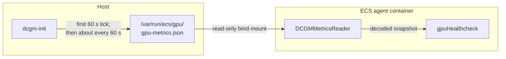
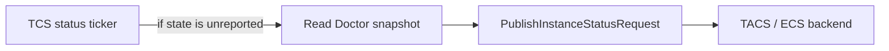
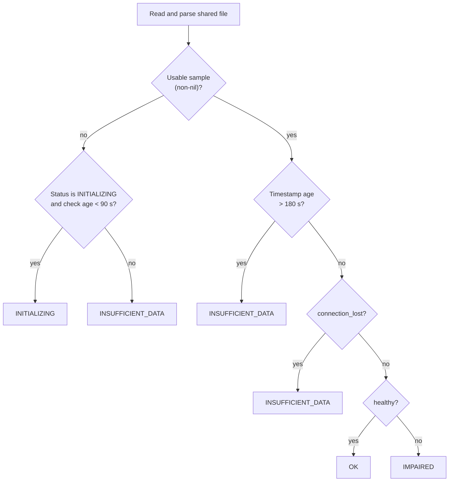
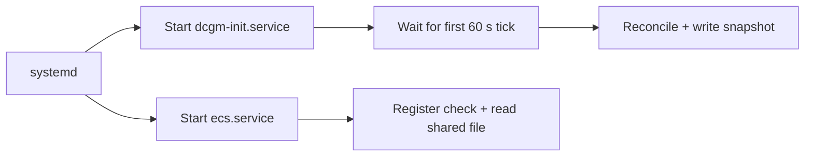

# GPU Instance Health Check (`ACCELERATED_COMPUTE`)

This document describes how the Linux ECS agent derives and reports GPU instance
health. The `ACCELERATED_COMPUTE` check is separate from GPU utilization metrics:
metrics answer "how busy is the GPU?", while this check answers "is GPU health
known, healthy, or impaired?"

The agent-side check is enabled by GPU support. The public ECS documentation lists
`ACCELERATED_COMPUTE` health as available for
[Amazon ECS Managed Instances][aws-health].

## Data path

### Producing and reading the shared file



1. [`dcgm-init`][producer] starts a 60-second ticker and collects on ticker
   events; it does not collect once up front. A DCGM reconcile or
   metric-collection failure still produces a status-only snapshot. A marshal
   or file-write failure leaves the previous snapshot in place.
2. The producer writes indented JSON to a temporary file and renames it over the
   final path. After the first successful rename, readers see either the
   previous complete snapshot or the new complete snapshot, not a partial
   write. Before that rename, `ensureCreatable` can leave an empty final file,
   which the reader treats as no usable sample.
3. [`ecs-init`][mount] bind-mounts the dedicated GPU directory read-only into
   the agent container when GPU support is enabled and NVIDIA devices are
   present. If it cannot create the host directory, it logs the error and skips
   the mount.
4. [`DCGMMetricsReader.GetGPUMetrics()`][reader] reads and decodes the file. It
   returns no sample for a missing, unreadable, empty, malformed, or invalidly
   timestamped file. The timestamp is validated as RFC3339 but returned as part
   of the decoded data rather than as a separate value.
5. The health check consumes the status fields and evaluates timestamp freshness.
   A stale file (older than 180 seconds) is treated as insufficient data. The
   separate [stats pipeline][stats] consumes the `gpus` array and de-duplicates
   only the exact timestamp last handed to TACS.

## Control path

The data producer is independent of both the trigger that runs the health check
and the TCS loop that publishes its current state.

### Running the check


The [heartbeat responder][heartbeat] starts `RunHealthchecks()` asynchronously.
After running all registered checks, the [doctor][doctor] marks its current state
as not reported.

### Publishing the latest state



The [TCS client][tcs-client] marks the state as reported only after a successful
send. If several health-check runs occur before the next publish tick, they can
coalesce: the request contains the latest tracked state, not one message for every
run.

The wire model supports `statusReason`, but the current
[`getInstanceStatuses()` implementation][tcs-client] does not populate it.
`unhealthy_reason` is logged locally when the result is `IMPAIRED`; this reporting
path does not send that value in `StatusReason`.

## Decision logic

[`gpuHealthcheck.RunCheck()`][healthcheck] evaluates conditions in a fixed order.



### Scenario table

| Input | Additional condition | Result |
|---|---|---|
| No usable sample | Still `INITIALIZING` and check age is under 90 seconds | `INITIALIZING` |
| No usable sample | Grace expired, or status already left `INITIALIZING` | `INSUFFICIENT_DATA` |
| Usable sample | Timestamp older than 180 seconds | `INSUFFICIENT_DATA` |
| Usable sample | `connection_lost=true` | `INSUFFICIENT_DATA` |
| Usable sample | Connected, fresh, and `healthy=true` | `OK` |
| Usable sample | Connected, fresh, and `healthy=false` | `IMPAIRED` |

Important ordering and boundary behavior:

- **Boot grace is narrow.** It applies only to an unusable sample while the
  tracked status is still `INITIALIZING`. Data loss after any data-derived
  result becomes `INSUFFICIENT_DATA` immediately, even within the first 90
  seconds.
- **Staleness precedes content evaluation.** A syntactically valid file whose
  timestamp is older than 180 seconds (3× the producer's 60-second tick) is
  treated as stale. This detects a dead `dcgm-init` process and prevents a
  perpetually stale healthy/impaired verdict.
- **Connection loss precedes `healthy`.** The DCGM client can report
  `healthy=true` while disconnected if it has no known violation. Checking
  `connection_lost` first prevents an unknown state from becoming a false
  `OK` once connection loss is reported.
- **Statuses can recover.** Any later fresh, connected, healthy sample can move
  the check from `INSUFFICIENT_DATA` or `IMPAIRED` back to `OK`.

## Startup behavior

The restored feature service has no ordering relationship with `ecs.service`,
and the producer does not collect before its first ticker event.



The 90-second health-check grace allows the first periodic producer write to
land without immediately changing `INITIALIZING` to `INSUFFICIENT_DATA`. It does
not delay agent startup and is not a systemd readiness guarantee.

The unit has `ConditionPathExists=/usr/bin/nv-hostengine`. If GPU support is
configured but that condition prevents `dcgm-init` from starting, an unusable
file remains `INITIALIZING` only for the health-check grace and then becomes
`INSUFFICIENT_DATA`.

## Shared file format

The schema is defined in [`GPUMetricsFileData`][schema]. Production output is
indented JSON with an RFC3339 timestamp. An impaired snapshot can look like this:

```json
{
  "timestamp": "2026-07-19T19:47:15Z",
  "healthy": false,
  "unhealthy_reason": "XID_48",
  "gpus": []
}
```

| Field | Type | Meaning for health |
|---|---|---|
| `timestamp` | RFC3339 string | Validated by the reader; health treats age > 180 s as stale (INSUFFICIENT_DATA); stats suppresses only exact equality with the last reported timestamp |
| `healthy` | Boolean | `true` becomes `OK`; `false` becomes `IMPAIRED` after earlier guards pass |
| `unhealthy_reason` | Optional string | First critical XID reason when available; logged locally for `IMPAIRED` |
| `connection_lost` | Optional Boolean | Unknown DCGM state; takes precedence over `healthy` |
| `gpus` | Array | Per-device telemetry used by the metrics path, not by this health check |

`connection_lost` and `unhealthy_reason` use `omitempty`, so normal snapshots do
not contain explicit `false` or empty-string values. A non-XID critical violation
can set `healthy=false` while leaving `unhealthy_reason` empty.

The DCGM client's initialization grace is distinct from the health check's
90-second boot grace. While within the DCGM grace period after `lastShutdown`,
`IsConnectionLost()` returns false; outside it, a disconnected client returns
true. See [`IsHealthy()` and `IsConnectionLost()`][dcgm-client].

## Registration and platform scope

- On Linux, [`appendGPUHealthcheck()`][registration] registers the check only
  when `GPUSupportEnabled` is true. `NewGPUHealthcheck()` starts its tracker at
  `INITIALIZING`.
- On non-Linux platforms, the [build-tagged implementation][registration-other]
  returns the health-check list unchanged.
- [`newDoctorWithHealthchecks()`][agent] always registers the container-runtime
  check and conditionally appends this GPU check.
- Agent-side registration is controlled by GPU support. Public API documentation
  describes the `ACCELERATED_COMPUTE` health entry as an ECS Managed Instances
  feature.

## Customer-facing API queries and expected responses

### Query instance health status

The `ACCELERATED_COMPUTE` health check result is exposed through the
`DescribeContainerInstances` API. You **must** include `CONTAINER_INSTANCE_HEALTH`
in the `--include` parameter to see health data.

#### CLI query

```bash
aws ecs describe-container-instances \
  --cluster my-gpu-cluster \
  --container-instances arn:aws:ecs:us-east-1:123456789012:container-instance/my-gpu-cluster/abc123def456 \
  --include CONTAINER_INSTANCE_HEALTH \
  --region us-east-1
```

#### Healthy GPU response

When the GPU is healthy and dcgm-init is running normally:

```json
{
  "containerInstances": [
    {
      "containerInstanceArn": "arn:aws:ecs:us-east-1:123456789012:container-instance/my-gpu-cluster/abc123def456",
      "healthStatus": {
        "overallStatus": "OK",
        "details": [
          {
            "type": "CONTAINER_RUNTIME",
            "status": "OK",
            "lastUpdated": "2026-07-20T10:05:00Z",
            "lastStatusChange": "2026-07-20T08:00:00Z"
          },
          {
            "type": "ACCELERATED_COMPUTE",
            "status": "OK",
            "lastUpdated": "2026-07-20T10:05:00Z",
            "lastStatusChange": "2026-07-20T08:00:00Z"
          }
        ]
      }
    }
  ]
}
```

#### Impaired GPU response (XID error detected)

When DCGM reports a critical XID violation (e.g., double-bit ECC error):

```json
{
  "containerInstances": [
    {
      "healthStatus": {
        "overallStatus": "IMPAIRED",
        "details": [
          {
            "type": "CONTAINER_RUNTIME",
            "status": "OK",
            "lastUpdated": "2026-07-20T10:05:00Z",
            "lastStatusChange": "2026-07-20T08:00:00Z"
          },
          {
            "type": "ACCELERATED_COMPUTE",
            "status": "IMPAIRED",
            "lastUpdated": "2026-07-20T10:05:00Z",
            "lastStatusChange": "2026-07-20T10:04:00Z"
          }
        ]
      }
    }
  ]
}
```

#### Insufficient data response (dcgm-init not running or DCGM disconnected)

When the metrics file is stale, missing, or DCGM connection is lost:

```json
{
  "containerInstances": [
    {
      "healthStatus": {
        "overallStatus": "INSUFFICIENT_DATA",
        "details": [
          {
            "type": "CONTAINER_RUNTIME",
            "status": "OK",
            "lastUpdated": "2026-07-20T10:05:00Z",
            "lastStatusChange": "2026-07-20T08:00:00Z"
          },
          {
            "type": "ACCELERATED_COMPUTE",
            "status": "INSUFFICIENT_DATA",
            "lastUpdated": "2026-07-20T10:05:00Z",
            "lastStatusChange": "2026-07-20T10:02:00Z"
          }
        ]
      }
    }
  ]
}
```

#### Initializing response (instance just started, first metrics not yet available)

During the first 90 seconds after agent startup before dcgm-init writes:

```json
{
  "containerInstances": [
    {
      "healthStatus": {
        "overallStatus": "OK",
        "details": [
          {
            "type": "CONTAINER_RUNTIME",
            "status": "OK",
            "lastUpdated": "2026-07-20T10:00:05Z",
            "lastStatusChange": "2026-07-20T10:00:00Z"
          },
          {
            "type": "ACCELERATED_COMPUTE",
            "status": "INITIALIZING",
            "lastUpdated": "2026-07-20T10:00:05Z",
            "lastStatusChange": "2026-07-20T10:00:00Z"
          }
        ]
      }
    }
  ]
}
```

Note: `INITIALIZING` is considered `OK` by the backend's `overallStatus`
aggregation — it does not mark the instance as unhealthy during boot.

### Filtering for GPU health only

To extract just the ACCELERATED_COMPUTE status:

```bash
aws ecs describe-container-instances \
  --cluster my-gpu-cluster \
  --container-instances "$CONTAINER_INSTANCE_ARN" \
  --include CONTAINER_INSTANCE_HEALTH \
  --region us-east-1 \
  --query 'containerInstances[0].healthStatus.details[?type==`ACCELERATED_COMPUTE`]'
```

Expected output when healthy:

```json
[
  {
    "type": "ACCELERATED_COMPUTE",
    "status": "OK",
    "lastUpdated": "2026-07-20T10:05:00Z",
    "lastStatusChange": "2026-07-20T08:00:00Z"
  }
]
```

### Listing all container instances by health status

```bash
# Find all impaired GPU instances in a cluster
aws ecs list-container-instances \
  --cluster my-gpu-cluster \
  --status ACTIVE \
  --region us-east-1 \
  --query 'containerInstanceArns' \
  --output text | tr '\t' '\n' | while read arn; do
    status=$(aws ecs describe-container-instances \
      --cluster my-gpu-cluster \
      --container-instances "$arn" \
      --include CONTAINER_INSTANCE_HEALTH \
      --query 'containerInstances[0].healthStatus.details[?type==`ACCELERATED_COMPUTE`].status' \
      --output text)
    echo "$arn: $status"
done
```

### Important notes for customers

- **`--include CONTAINER_INSTANCE_HEALTH` is required.** Without it, the API
  omits the `healthStatus` field entirely.
- **`ACCELERATED_COMPUTE` only appears on GPU instances.** Non-GPU instances
  show only `CONTAINER_RUNTIME` in the details array.
- **`overallStatus` is an aggregation.** If any detail is `IMPAIRED`, the
  overall is `IMPAIRED`. If any is `INSUFFICIENT_DATA` (and none are `IMPAIRED`),
  the overall is `INSUFFICIENT_DATA`.
- **Health checks are eventually consistent.** The ACS heartbeat triggers checks
  and results propagate to the backend on the TCS ticker interval. There can be
  a delay of up to ~60 seconds between a GPU fault occurring and the API
  reflecting `IMPAIRED`.
- **The v1 agent metadata endpoint does NOT expose health.** Use the ECS API.

## Edge cases and failure modes

This section documents the behavior under specific failure scenarios. Each entry
states what the customer sees via `DescribeContainerInstances` and whether the
system self-heals.

### dcgm-init crashes or is stopped

The last snapshot stays on disk (atomic rename guarantees no partial writes).
The health check continues reading the file until it becomes stale.

| Scenario | Customer sees | Duration | Self-heals? |
|---|---|---|---|
| Crash with `Restart=always` | No change (new write lands ~70s after restart, under 180s threshold) | Invisible | Yes |
| Permanent stop | OK for up to 180s, then INSUFFICIENT_DATA | Until restart | No — manual |

Notable: if the GPU was IMPAIRED when dcgm-init died, the staleness check
eventually overwrites IMPAIRED with INSUFFICIENT_DATA. The impairment signal
is replaced by a "data unavailable" signal after 180 seconds.

### nv-hostengine (DCGM daemon) crashes

dcgm-init detects the failure on its next 60-second tick via `Reconcile()`.
The file is written with `connection_lost: true` (once outside the DCGM
initialization grace period). The health check reports INSUFFICIENT_DATA.

Within the first 3 minutes of dcgm-init's process life (the DCGM grace period),
`IsConnectionLost()` returns false even when disconnected, so the file reports
`healthy: true, connection_lost: false`. During this window the customer sees
a **false OK** for a GPU whose health is unknown. Self-heals when the grace
expires or nv-hostengine restarts.

### Agent container restarts

The health check starts at INITIALIZING. Behavior depends on the file state:

| File state | First check result | Notes |
|---|---|---|
| Fresh and healthy | OK immediately | State survives via the file |
| Fresh and impaired | IMPAIRED immediately | Correct |
| Missing (host rebooted, tmpfs wiped) | INITIALIZING for 90s, then INSUFFICIENT_DATA | dcgm-init restart writes within the grace window |
| Stale (dcgm-init dead for hours) | INSUFFICIENT_DATA immediately | Staleness check fires before any content evaluation |

### Multiple rapid ACS heartbeats

`RunHealthchecks()` takes the Doctor's write lock, so concurrent goroutines
serialize rather than race. Worst case is briefly queuing on the mutex (the
file read is milliseconds). The status tracker has its own RWMutex for the
concurrent TCS reader. No data corruption can occur.

### TCS connection drops

The Doctor keeps running checks on each ACS heartbeat. `statusReported` stays
false (never set true without a successful send), so the TCS client retries
on every 20-second tick. On reconnect, the latest tracked state is published
immediately. The customer sees the last successfully published status with a
frozen `lastUpdated` timestamp until reconnect. Self-heals.

If ACS is down (no heartbeats), `RunHealthchecks` never runs and the tracker
is frozen. The backend serves the last known state.

### GPU hardware fault (XID error)

1. nv-hostengine emits the XID through the DCGM policy violation channel.
2. `listenForPolicyViolations` filters against `wellKnownXIDCodes` — critical
   codes (48, 79, 110, etc.) set `hasViolation = true`.
3. Next 60-second tick: `IsHealthy()` returns false → file written as
   `healthy: false, unhealthy_reason: "XID_48"`.
4. Agent `RunCheck` reads IMPAIRED. Published to TACS within one heartbeat + tick.

**Worst-case latency:** ~60s (tick) + heartbeat interval + 20s (publish) ≈ 90 seconds.

**Persistence caveat:** `hasViolation` persists across DCGM reconnections but is
cleared on dcgm-init process restart (new client). A one-shot XID on a genuinely
broken GPU can revert to OK if dcgm-init restarts and `dcgm.HealthCheck` does not
independently return FAIL.

### Clock skew

Containers share the host kernel's `CLOCK_REALTIME` — the writer (dcgm-init on
host) and reader (agent in container) use the same clock. True clock skew cannot
occur. NTP step adjustments can cause transient false staleness (forward step) or
briefly blind the staleness check (backward step), but both self-correct within
one producer tick.

### File system full

`os.WriteFile` to the temp file fails. The atomic rename never executes, so the
previous snapshot at the final path is untouched. The health check reads the
aging snapshot. After 180 seconds it reports INSUFFICIENT_DATA. Self-heals the
tick after space frees. Note: `/var/run` is tmpfs, so "full" means memory
exhaustion — rare for a ~1 KB JSON file.

### Boot race: agent starts before dcgm-init

There is no systemd ordering between `ecs.service` and `dcgm-init.service`.
The 90-second boot grace covers the typical case:

```
t=0s     Agent starts, check at INITIALIZING
t=0-90s  File missing → INITIALIZING (benign, Ok()==true)
t≈60-70s dcgm-init's first write lands
t=next   RunCheck reads fresh data → OK
```

If dcgm-init is delayed (slow `cloud-final.service`), the check flips to
INSUFFICIENT_DATA at t=90s, then self-heals when the first write arrives.
The boot grace is a one-shot: once the status leaves INITIALIZING, it cannot
re-enter the grace window.

### DCGM grace period vs health-check boot grace

Two independent grace periods can overlap during the first ~90 seconds of boot:

- **DCGM client grace (3 min):** suppresses `IsConnectionLost()` → file says
  `connection_lost: false` even when disconnected.
- **Health-check boot grace (90s):** tolerates a missing file while status is
  INITIALIZING.

**Masking risk:** If nv-hostengine is down at boot, dcgm-init's first write at
~60s says `healthy: true, connection_lost: false` (no violation, grace
suppresses connection loss). The agent reads this as OK. The false OK persists
until the DCGM grace expires (~3 min), when `connection_lost` flips to true
and the health check reports INSUFFICIENT_DATA.

A dcgm-init crash-loop with restart interval between 60s and 180s can produce
a **perpetual false OK**: each restart resets the DCGM grace and writes a fresh
healthy file before its grace expires.

## Operational verification

On the host, inspect the producer snapshot:

```bash
sudo python3 -m json.tool < /var/run/ecs/gpu/gpu-metrics.json
```

For local agent diagnostics, search the agent log. Successful `OK` evaluations
are visible through the generic `Ran instance health check` message at debug log
level; impaired and connection-lost paths also emit GPU-specific logs.

```bash
sudo grep -E 'GPUHealthcheck|ACCELERATED_COMPUTE|Ran instance health check' \
  /var/log/ecs/ecs-agent.log*
```

For staleness detection (dcgm-init stopped or stuck):

```bash
sudo grep -E 'GPU metrics file is stale' /var/log/ecs/ecs-agent.log*
```

## Source map

| File | Responsibility |
|---|---|
| [`agent/doctor/gpu_healthcheck.go`](./gpu_healthcheck.go) | Decision logic, staleness detection, and `ACCELERATED_COMPUTE` type |
| [`agent/doctor/gpu_healthcheck_test.go`](./gpu_healthcheck_test.go) | Status, boot-grace, staleness, connection-loss, and transition tests |
| [`agent/doctor/statustracker/statustracker.go`](./statustracker/statustracker.go) | Current/previous status and timestamps |
| [`agent/gpu/dcgm_metrics_reader_linux.go`](../gpu/dcgm_metrics_reader_linux.go) | Shared-file read, JSON decode, and timestamp parse |
| [`agent/app/agent_gpu_linux.go`](../app/agent_gpu_linux.go) | Linux registration when GPU support is enabled |
| [`agent/app/agent_gpu_unsupported.go`](../app/agent_gpu_unsupported.go) | Non-Linux no-op registration |
| [`agent/app/agent.go`](../app/agent.go) | Doctor assembly |
| [`dcgm-init/engine/engine.go`](../../dcgm-init/engine/engine.go) | Periodic collection and temporary-file rename |
| [`ecs-agent/gpu/dcgm/client.go`](../../ecs-agent/gpu/dcgm/client.go) | DCGM connection, health, and violation state |
| [`ecs-agent/gpu/types/types.go`](../../ecs-agent/gpu/types/types.go) | Shared file path and schema |
| [`ecs-init/docker/docker.go`](../../ecs-init/docker/docker.go) | Read-only directory bind mount |
| [`packaging/.../dcgm-init.service`](../../packaging/amazon-linux-ami-integrated/dcgm-init.service) | systemd condition and service lifecycle |
| [`ecs-agent/acs/session/heartbeat_responder.go`](../../ecs-agent/acs/session/heartbeat_responder.go) | ACS heartbeat trigger |
| [`ecs-agent/doctor/doctor.go`](../../ecs-agent/doctor/doctor.go) | Generic health-check runner and report-state tracking |
| [`ecs-agent/tcs/client/client.go`](../../ecs-agent/tcs/client/client.go) | Status snapshot and TCS publication |
| [`ecs-agent/tcs/model/ecstcs/api.go`](../../ecs-agent/tcs/model/ecstcs/api.go) | Instance-status wire shape |
| [`ecs-agent/tcs/model/ecstcs/types.go`](../../ecs-agent/tcs/model/ecstcs/types.go) | Health-check type and status values |
| [`agent/stats/engine.go`](../stats/engine.go) | Separate GPU metrics consumer |

## AWS documentation

- [Monitor Amazon ECS container instance health][aws-health]
- [DescribeContainerInstances API][api-describe]
- [Monitoring Amazon ECS Managed Instances, including GPU monitoring][aws-gpu-monitoring]

[agent]: ../app/agent.go
[api-describe]: https://docs.aws.amazon.com/AmazonECS/latest/APIReference/API_DescribeContainerInstances.html
[aws-gpu-monitoring]: https://docs.aws.amazon.com/AmazonECS/latest/developerguide/monitoring-managed-instances.html#gpu-monitoring-managed-instances
[aws-health]: https://docs.aws.amazon.com/AmazonECS/latest/developerguide/container-instance-health.html
[dcgm-client]: ../../ecs-agent/gpu/dcgm/client.go
[doctor]: ../../ecs-agent/doctor/doctor.go
[healthcheck]: ./gpu_healthcheck.go
[heartbeat]: ../../ecs-agent/acs/session/heartbeat_responder.go
[mount]: ../../ecs-init/docker/docker.go
[producer]: ../../dcgm-init/engine/engine.go
[reader]: ../gpu/dcgm_metrics_reader_linux.go
[registration]: ../app/agent_gpu_linux.go
[registration-other]: ../app/agent_gpu_unsupported.go
[schema]: ../../ecs-agent/gpu/types/types.go
[stats]: ../stats/engine.go
[tcs-client]: ../../ecs-agent/tcs/client/client.go
[unit]: ../../packaging/amazon-linux-ami-integrated/dcgm-init.service
