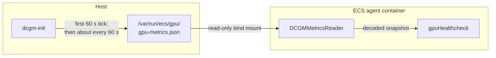
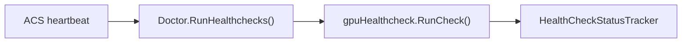
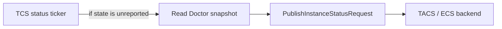
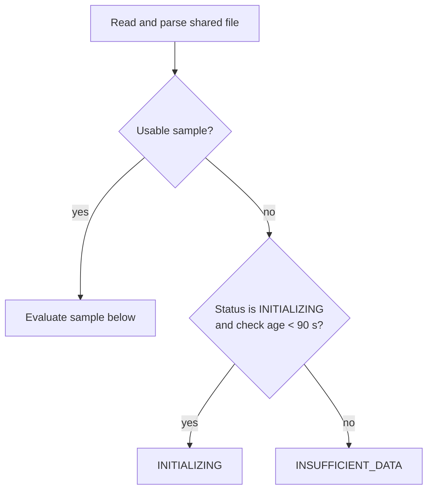
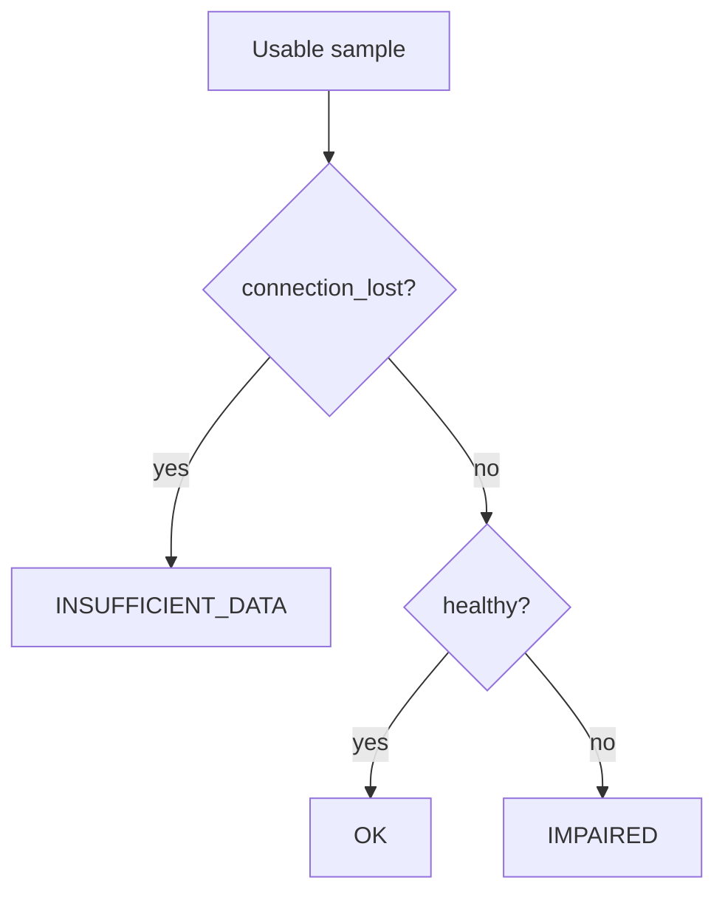
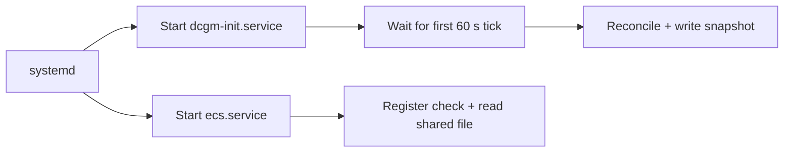

# GPU Instance Health Check (`ACCELERATED_COMPUTE`)

This document describes how the Linux ECS agent derives and reports GPU instance
health. The `ACCELERATED_COMPUTE` check is separate from GPU utilization metrics:
metrics answer "how busy is the GPU?", while this check answers "is GPU health
known, healthy, or impaired?"

The agent-side check is enabled by GPU support. The public ECS documentation lists
`ACCELERATED_COMPUTE` health as available for
[Amazon ECS Managed Instances][aws-health].

## Data path

### Producing and reading the shared file



1. [`dcgm-init`][producer] starts a 60-second ticker and collects on ticker
   events; it does not collect once up front. A DCGM reconcile or
   metric-collection failure still produces a status-only snapshot. A marshal
   or file-write failure leaves the previous snapshot in place.
2. The producer writes indented JSON to a temporary file and renames it over the
   final path. After the first successful rename, readers see either the
   previous complete snapshot or the new complete snapshot, not a partial
   write. Before that rename, `ensureCreatable` can leave an empty final file,
   which the reader treats as no usable sample.
3. [`ecs-init`][mount] bind-mounts the dedicated GPU directory read-only into
   the agent container when GPU support is enabled and NVIDIA devices are
   present. If it cannot create the host directory, it logs the error and skips
   the mount.
4. [`DCGMMetricsReader.GetGPUMetrics()`][reader] reads and decodes the file. It
   returns no sample for a missing, unreadable, empty, malformed, or invalidly
   timestamped file. The timestamp is validated as RFC3339 but returned as part
   of the decoded data rather than as a separate value.
5. The health check consumes the status fields. It does not evaluate timestamp
   age or ordering. The separate [stats pipeline][stats] consumes the `gpus`
   array and de-duplicates only the exact timestamp last handed to TACS.

## Control path

The data producer is independent of both the trigger that runs the health check
and the TCS loop that publishes its current state.

### Running the check



The [heartbeat responder][heartbeat] starts `RunHealthchecks()` asynchronously.
After running all registered checks, the [doctor][doctor] marks its current state
as not reported.

### Publishing the latest state



The [TCS client][tcs-client] marks the state as reported only after a successful
send. If several health-check runs occur before the next publish tick, they can
coalesce: the request contains the latest tracked state, not one message for every
run.

The wire model supports `statusReason`, but the current
[`getInstanceStatuses()` implementation][tcs-client] does not populate it.
`unhealthy_reason` is logged locally when the result is `IMPAIRED`; this reporting
path does not send that value in `StatusReason`.

## Decision logic

[`gpuHealthcheck.RunCheck()`][healthcheck] evaluates conditions in a fixed order.
The timestamp must be syntactically valid for the reader to return a sample, but
its age and ordering do not affect health.

### 1. No usable sample



### 2. Usable sample



### Scenario table

| Input | Additional condition | Result |
|---|---|---|
| No usable sample | Still `INITIALIZING` and check age is under 90 seconds | `INITIALIZING` |
| No usable sample | Grace expired, or status already left `INITIALIZING` | `INSUFFICIENT_DATA` |
| Usable sample | `connection_lost=true` | `INSUFFICIENT_DATA` |
| Usable sample | Connected and `healthy=true` | `OK` |
| Usable sample | Connected and `healthy=false` | `IMPAIRED` |

Important ordering and boundary behavior:

- **Boot grace is narrow.** It applies only to an unusable sample while the
  tracked status is still `INITIALIZING`. Data loss after any data-derived
  result becomes `INSUFFICIENT_DATA` immediately, even within the first 90
  seconds.
- **Connection loss precedes `healthy`.** The DCGM client can report
  `healthy=true` while disconnected if it has no known violation. Checking
  `connection_lost` first prevents an unknown state from becoming a false
  `OK` once connection loss is reported.
- **Timestamp staleness is not evaluated by health.** A syntactically valid old,
  future, or backward-looking timestamp does not change the health result.
- **Statuses can recover.** Any later usable, connected sample can move the
  check from `INSUFFICIENT_DATA` or `IMPAIRED` back to `OK`.

## Startup behavior

The restored feature service has no ordering relationship with `ecs.service`,
and the producer does not collect before its first ticker event.



The 90-second health-check grace allows the first periodic producer write to
land without immediately changing `INITIALIZING` to `INSUFFICIENT_DATA`. It does
not delay agent startup and is not a systemd readiness guarantee.

The unit has `ConditionPathExists=/usr/bin/nv-hostengine`. If GPU support is
configured but that condition prevents `dcgm-init` from starting, an unusable
file remains `INITIALIZING` only for the health-check grace and then becomes
`INSUFFICIENT_DATA`.

## Shared file format

The schema is defined in [`GPUMetricsFileData`][schema]. Production output is
indented JSON with an RFC3339 timestamp. An impaired snapshot can look like this:

```json
{
  "timestamp": "2026-07-19T19:47:15Z",
  "healthy": false,
  "unhealthy_reason": "XID_48",
  "gpus": []
}
```

| Field | Type | Meaning for health |
|---|---|---|
| `timestamp` | RFC3339 string | Validated by the reader; health ignores age/order, while stats suppresses only exact equality with the last reported timestamp |
| `healthy` | Boolean | `true` becomes `OK`; `false` becomes `IMPAIRED` after earlier guards pass |
| `unhealthy_reason` | Optional string | First critical XID reason when available; logged locally for `IMPAIRED` |
| `connection_lost` | Optional Boolean | Unknown DCGM state; takes precedence over `healthy` |
| `gpus` | Array | Per-device telemetry used by the metrics path, not by this health check |

`connection_lost` and `unhealthy_reason` use `omitempty`, so normal snapshots do
not contain explicit `false` or empty-string values. A non-XID critical violation
can set `healthy=false` while leaving `unhealthy_reason` empty.

The DCGM client's initialization grace is distinct from the health check's
90-second boot grace. While within the DCGM grace period after `lastShutdown`,
`IsConnectionLost()` returns false; outside it, a disconnected client returns
true. See [`IsHealthy()` and `IsConnectionLost()`][dcgm-client].

## Registration and platform scope

- On Linux, [`appendGPUHealthcheck()`][registration] registers the check only
  when `GPUSupportEnabled` is true. `NewGPUHealthcheck()` starts its tracker at
  `INITIALIZING`.
- On non-Linux platforms, the [build-tagged implementation][registration-other]
  returns the health-check list unchanged.
- [`newDoctorWithHealthchecks()`][agent] always registers the container-runtime
  check and conditionally appends this GPU check.
- Agent-side registration is controlled by GPU support. Public API documentation
  describes the `ACCELERATED_COMPUTE` health entry as an ECS Managed Instances
  feature.

## Operational verification

On the host, inspect the producer snapshot:

```bash
sudo python3 -m json.tool < /var/run/ecs/gpu/gpu-metrics.json
```

For local agent diagnostics, search the agent log. Successful `OK` evaluations
are visible through the generic `Ran instance health check` message at debug log
level; impaired and connection-lost paths also emit GPU-specific logs.

```bash
sudo grep -E 'GPUHealthcheck|ACCELERATED_COMPUTE|Ran instance health check' \
  /var/log/ecs/ecs-agent.log*
```

The v1 agent metadata endpoint does **not** expose instance health-check state.
For an ECS Managed Instance, query the backend and explicitly request container
instance health:

```bash
aws ecs describe-container-instances \
  --cluster <CLUSTER> \
  --container-instances <CONTAINER_INSTANCE_ARN> \
  --include CONTAINER_INSTANCE_HEALTH \
  --query 'containerInstances[0].healthStatus'
```

Without `--include CONTAINER_INSTANCE_HEALTH`, the API omits `healthStatus`.

## Source map

| File | Responsibility |
|---|---|
| [`agent/doctor/gpu_healthcheck.go`](./gpu_healthcheck.go) | Decision logic and `ACCELERATED_COMPUTE` type |
| [`agent/doctor/gpu_healthcheck_test.go`](./gpu_healthcheck_test.go) | Status, boot-grace, connection-loss, timestamp-independence, and transition tests |
| [`agent/doctor/statustracker/statustracker.go`](./statustracker/statustracker.go) | Current/previous status and timestamps |
| [`agent/gpu/dcgm_metrics_reader_linux.go`](../gpu/dcgm_metrics_reader_linux.go) | Shared-file read, JSON decode, and timestamp parse |
| [`agent/app/agent_gpu_linux.go`](../app/agent_gpu_linux.go) | Linux registration when GPU support is enabled |
| [`agent/app/agent_gpu_unsupported.go`](../app/agent_gpu_unsupported.go) | Non-Linux no-op registration |
| [`agent/app/agent.go`](../app/agent.go) | Doctor assembly |
| [`dcgm-init/engine/engine.go`](../../dcgm-init/engine/engine.go) | Periodic collection and temporary-file rename |
| [`ecs-agent/gpu/dcgm/client.go`](../../ecs-agent/gpu/dcgm/client.go) | DCGM connection, health, and violation state |
| [`ecs-agent/gpu/types/types.go`](../../ecs-agent/gpu/types/types.go) | Shared file path and schema |
| [`ecs-init/docker/docker.go`](../../ecs-init/docker/docker.go) | Read-only directory bind mount |
| [`packaging/.../dcgm-init.service`](../../packaging/amazon-linux-ami-integrated/dcgm-init.service) | systemd condition and service lifecycle |
| [`ecs-agent/acs/session/heartbeat_responder.go`](../../ecs-agent/acs/session/heartbeat_responder.go) | ACS heartbeat trigger |
| [`ecs-agent/doctor/doctor.go`](../../ecs-agent/doctor/doctor.go) | Generic health-check runner and report-state tracking |
| [`ecs-agent/tcs/client/client.go`](../../ecs-agent/tcs/client/client.go) | Status snapshot and TCS publication |
| [`ecs-agent/tcs/model/ecstcs/api.go`](../../ecs-agent/tcs/model/ecstcs/api.go) | Instance-status wire shape |
| [`ecs-agent/tcs/model/ecstcs/types.go`](../../ecs-agent/tcs/model/ecstcs/types.go) | Health-check type and status values |
| [`agent/stats/engine.go`](../stats/engine.go) | Separate GPU metrics consumer |

## AWS documentation

- [Monitor Amazon ECS container instance health][aws-health]
- [DescribeContainerInstances API][api-describe]
- [Monitoring Amazon ECS Managed Instances, including GPU monitoring][aws-gpu-monitoring]

[agent]: ../app/agent.go
[api-describe]: https://docs.aws.amazon.com/AmazonECS/latest/APIReference/API_DescribeContainerInstances.html
[aws-gpu-monitoring]: https://docs.aws.amazon.com/AmazonECS/latest/developerguide/monitoring-managed-instances.html#gpu-monitoring-managed-instances
[aws-health]: https://docs.aws.amazon.com/AmazonECS/latest/developerguide/container-instance-health.html
[dcgm-client]: ../../ecs-agent/gpu/dcgm/client.go
[doctor]: ../../ecs-agent/doctor/doctor.go
[healthcheck]: ./gpu_healthcheck.go
[heartbeat]: ../../ecs-agent/acs/session/heartbeat_responder.go
[mount]: ../../ecs-init/docker/docker.go
[producer]: ../../dcgm-init/engine/engine.go
[reader]: ../gpu/dcgm_metrics_reader_linux.go
[registration]: ../app/agent_gpu_linux.go
[registration-other]: ../app/agent_gpu_unsupported.go
[schema]: ../../ecs-agent/gpu/types/types.go
[stats]: ../stats/engine.go
[tcs-client]: ../../ecs-agent/tcs/client/client.go
[unit]: ../../packaging/amazon-linux-ami-integrated/dcgm-init.service
